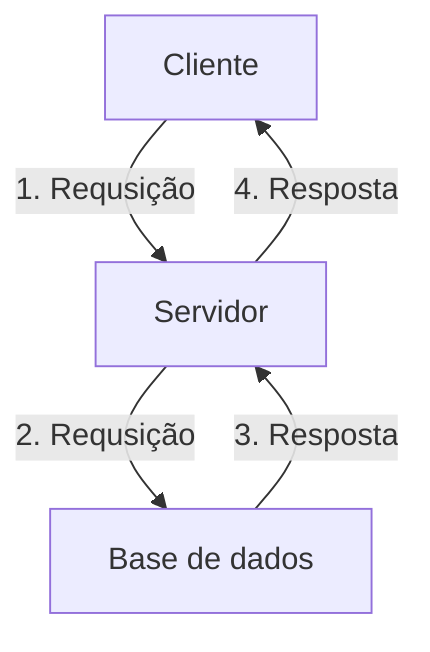
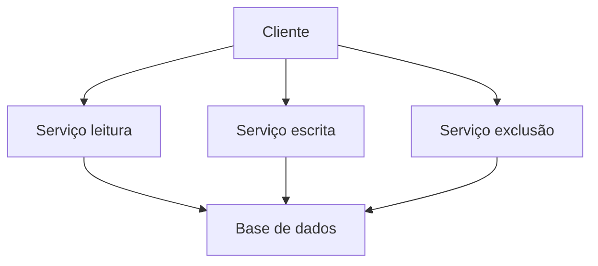
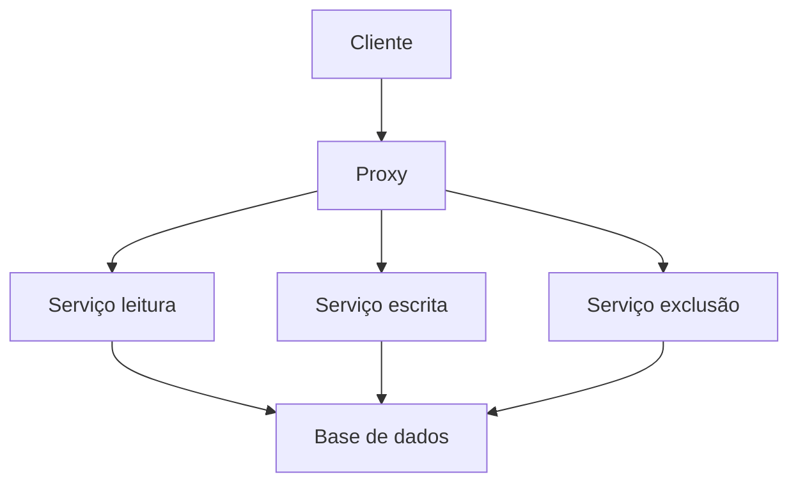
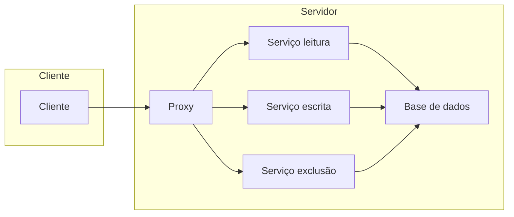

# Sistemas distribuídos
## Laboratorio 2 - Aplicação cliente/servidor básica

O objetivo deste trabalho é desenvolver um **dicionário remoto** que poderá ser consultado e alterado. As chaves e valores do dicionário serão strings. Para esse fim, será desenvolvido uma plicação distribúida utilizando sockets e servidores multiplexados.

### Arquitetura de software
Temos 3 tipos principais de arquiteturas para sistemas distribuídos, são eles: arquitetura de camadas, arquitetura orientada à serviço e arquitetura orientada à eventos.

  
Na aplicação desenvolvida, não é necessário utilizar uma arquitetura orientada a eventos, já que não há a necessidade de desacoplamento em relação ao tempo. Em outras palavras, para realizar uma ação, como inserir ou ler o valor de uma chave, é necessário que todos os componentes do sistema estejam ativos simultaneamente.

A aplicação é adequada para uma arquitetura em camadas, na qual os componentes são organizados em níveis distintos e interagem por meio de interfaces bem definidas. Para ilustrar esse conceito, podemos considerar a aplicação com três componentes principais: a interface do cliente, a base de dados e o servidor, responsável por receber e processar as requisições do cliente. Esses componentes trabalham juntos como exemplificado na figura a seguir:

Com o objetivo modularizar o código e também para fins didáticos foi utilizado o modelo baseado em serviço onde há um serviço ou componente do sistema para cada uma das operações possíveis de serem relizadas na base de dados. Logo, obtemos a seguinte arquitetura de software:

Uma desvantagem dessa arquitetura é a necessidade do cliente em armazenar os endereços de cada serviço utilizado no sistema. Por isso, foi adicionado mais um componente que terá o papel de um proxy, ou seja, será responsável por receber todas as requisições do cliente para redireciona-lás para o componente correto conforme a figura a seguir:

Resumidamente, temos 6 componentes:
**Cliente:** Responsável por fazer as requisições de inserir ou ler do arquivo. Essas requisições serão enviadas ao proxy
**Proxy:** Responsável por verificar qual a requisição do cliente e redirecioná-la ao servidor correto.
**Serviços (leitura, escrita e exclusão):** Responsáveis por lidar com a base de dados realizando suas respectivas funções
**Base de dados:** Armazenar o conteúdo do dicionário

#### Protocolo de comunicação
Foi utilizado sockets para a comunicação entre os serviços, além disso, foi definido um protocolo para as mensagens trocadas. Todas as mensagens são strings. As requisições feitas pelo **cliente** possuem 3 partes: o método utilizado, a chave e, se necessário, o valor. O campo 'valor' é utilizado apenas nas requisições de inserir. O **Proxy** recebe as requisições, retira o método da string e redireciona o resultado para o serviço correto. 

Os serviços de escrever e excluir retornam uma string com uma mensagem indicando que a operação foi um sucesso. Já o serviço de leitura retorna os valores para a chave recebida ou uma mensagem indicando que não há valores para aquela chave.

Os métodos utilizados são o GET, POST e DELETE conforme a tabela a seguir:

| SERVIÇO        |REQUISIÇÃO                    |
|----------------|-------------------------------
|Leitura         |`GET chave`            		|
|Escrita         |`POST chave valor`            |
|Exclusão        |`DELETE chave`				|

### Arquitetura de sistema
A arquitetura de sistema utilizada foi a arquitetura cliente/servidor  onde o componente cliente fica na máquina do cliente e os outros componentes ficam na máquina do servidor. Dessa forma, a maior parte do trabalho computacional fica no lado do servidor. A arquitetura pode ser visualizada a seguir:

